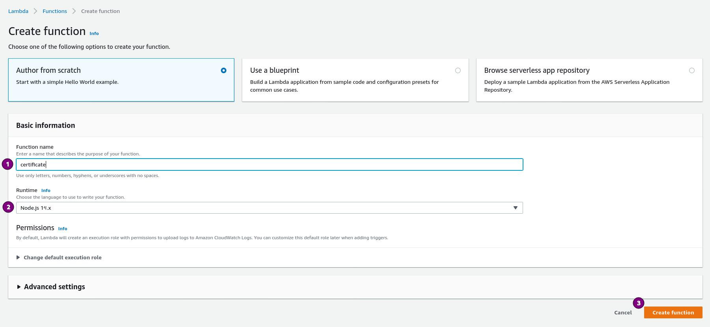
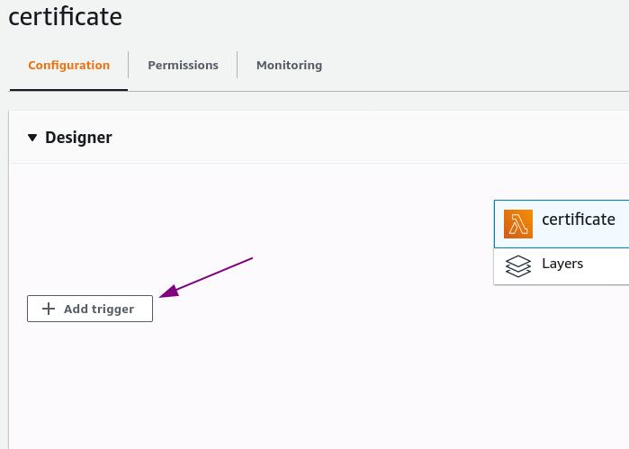
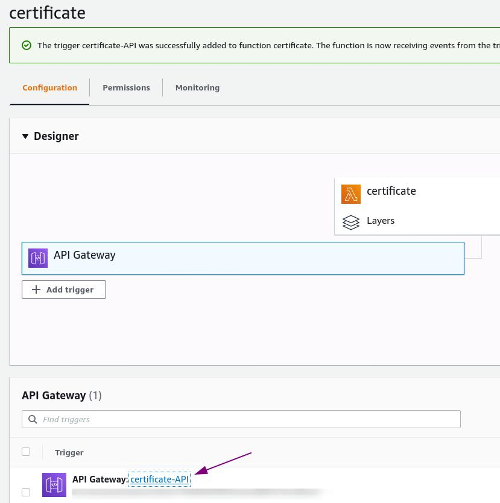
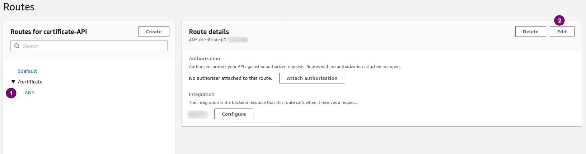
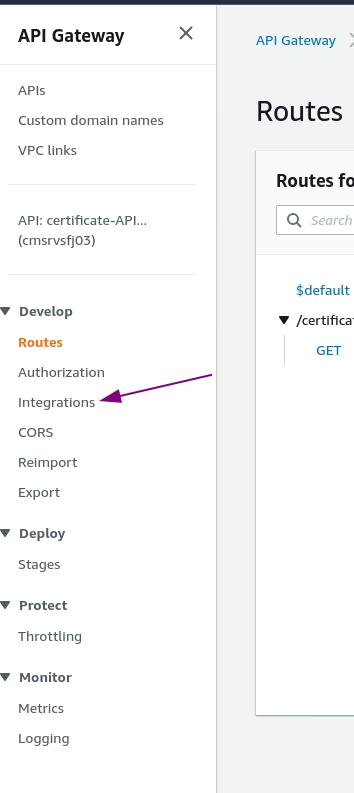
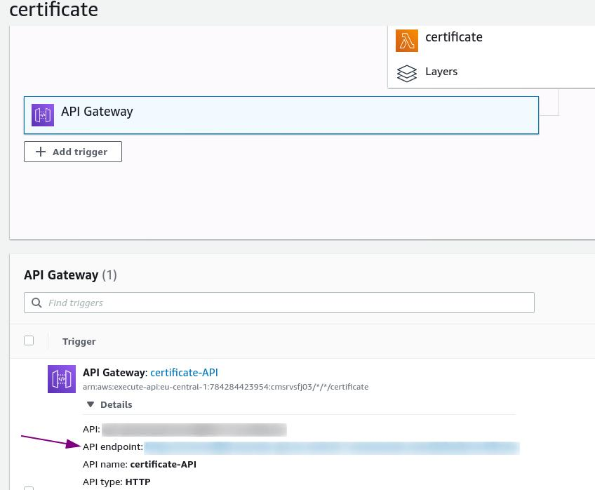

# Chexxo Server
## Introduction
Since Chromium based browsers do not provide an option to read the certificate from the webRequest-API, a server component is needed in order for Chexxo to function properly. Therefore we have written a simple Server which provides the extension with the certificate for the requested Webpage.

There are three ways to use the Server:
1. Locally
    - The server can be started locally on your machine by using the provided express implementation. See tutorial down below. This is the recommended way to use the server since many Man-In-The-Middle attack vectors are mitigated when using it locally.
2. AWS
    - You may run your own AWS-Lambda instance of the server by using the provided AWS-Implementation. See tutorial down below. Be aware, that this opens attack-vectors for hackers since the server is not hostet in your Network. If you want to provide the server to multiple employees the better variant would be to deploy the provided express implementation in your company network.
3. Chexxo-Provided
    - The extension comes preconfigured with the server provided by us. Whilst we do make sure the same code that is in this repository is also deployed on the server we do encourage you to use one of the options above. The main reason being, that we want to prevent overloading our infrastructure.

### API
The api is documented in an OpenAPI conform yaml [document](./openapi.yaml). It can be viewed by using the swagger editor [here](https://editor.swagger.io/).

### Documentation
The code documentation is done in typedoc and can be viewed by looking into the documentation folder of the respective release.

## Express Provider
In order to deploy the express variant of the server these steps have to be followed:
1. Install the latest version of `Node.js` and `npm` on the system which should run the server. As of now the minimum required `Node.js`-version is `12.19`.
2. Download the express folder from the latest server release.
3. Unzip the folder and open a terminal within the unzipped folder.
4. Run `npm i`, this will install the dependencies.
5. Run `node index.js` this will start the server on port 3000
    - To define your own port run `PORT=<your-port> node index.js`.
6. Test the server by opening a Browser and going to `http://localhost:3000/certificate/www.google.com`
    - The output should be a json including the certificate from www.google.com
7. Go to the settings page of your Chrome-Chexxo-Extension and fill in the setting `server` with the value `localhost:3000`.
8. You're all set to go. Start using Chexxo.

## AWS Provider
In order to deploy the server on AWS-Lambda these steps have to be followed:
1. Download the aws folder from the latest server release.
2. Open your `AWS Management Console`

3. Make sure you are in the correct aws-region. The region is shown in the top right corner.
4. Open the lambda service page and click on `Create Function`.

5. Set the function name to `getCertificate` and as runtime select the latest `NodeJS` version. Afterwards click `Create Function`.

6. In the code-overview delete `index.js`
7. Click on `Actions`->`Upload a .zip file` and select the previously downloaded aws folder of Chexxo.

    - Afterwards your code view should contain the file `index.js` in its root.
    
8. The lambda function is now ready. Time to add a trigger for it. In the `configuration` tab click on `+ Add Trigger`.

9. Select the trigger `API Gateway`, also select `HTTP API` as the API type. For Security select `open`. Afterwards click on `Add`.

10. Click on the gateway-name in order to open the gateway configuration.

11. On the left hand side of the gateway-configuration select `Routes`.

12. Click on `ANY` below the `/certificate` endpoint. Afterwards click on `Edit`.

13. Change `ANY` to `GET` and click `Save`.
14. On the left hand side of the gateway-configuration select `Integrations`.

15. Select `$default` and click on `Edit Integration`.

16. Make sure your function name is inside the `Lambda function` field and on `Save`. It is important, that you click on `Save` even if the function name was already correct.
14. Congratulations your server is setup.
15. Go to the settings page of your Chrome-Chexxo-Extension and fill in the setting `server` with the value of the API-Endpoint. Make sure to not include any subdirectories like `/default` into the settings value of the extension.

# FAQ
## I get a `No route to host` error all the time.
There are multiple reasons why this can happen. One of them being that the server runs into the request timeout defined by chexxo.

The Timeout it set to:
 - AWS:     500ms
 - Express: 3000ms

 In order to adjust the timeout open your servers `index.js` and adjust the number gives as a parameter to the `CertificateProvider`. Be aware that this timeout is only used by us in order to shorten the maximum request time. It does not overwrite options inside the http agent.